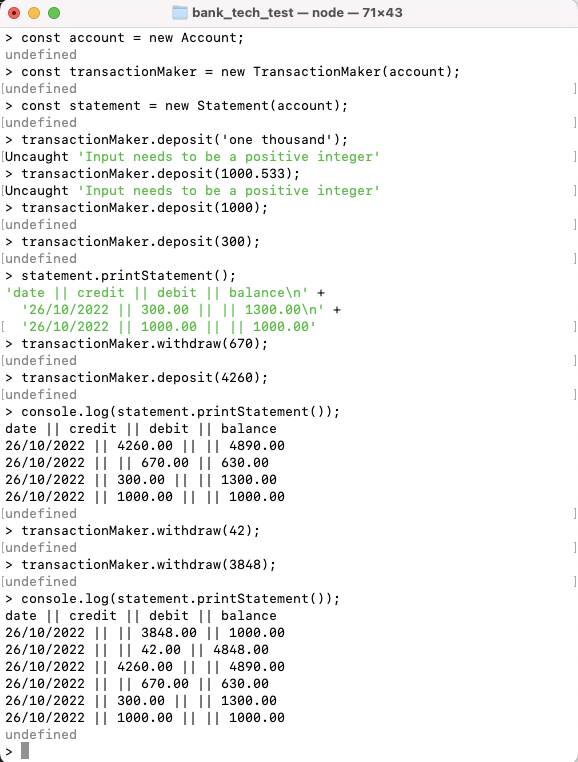

# Bank Tech Test

This is a little program I wrote in node.js to practise and demonstrate writing high quality code.

It simulates a bank account and keeps track of your balance, deposits and withdrawals.

Here is a  of the program in action.



## Usage:
Download a copy of this repository, then, in the directory, run 

`npm install`

To run the tests, run

`jest`

To see the coverage, run 

`jest --coverage`

Use the node REPL to run the program (by running `node`).

Run these lines first to import the classes and create instances of them:
```bash
const Transactions = require('./transactions');
const Account = require('./account');
const Statement = require('./statement');

const account = new Account;
const statement = new Statement;
const transactions = new Transactions(account, statement);
```

Then you can run
```bash
transactions.deposit(amount);
transactions.withdraw(amount);
statement.printStatement();
```
to interact with the program.

## My Approach:
I thought about the different classes and drew a diagram on how they should interact. 

There are 3 classes:
- Account - keeps track of the balance
- Statement - keeps track of the deposits and withdrawals and can print a statement for the user to see
- Transactions - handles deposits and withdrawals and updates the Account balance accordingly. Sends information about withdrawals and deposits with the correct date to an instance of the Statement class.


I wrote the programm following Test Driven Development (TDD), always starting with a test and then writing code to implement that feature. Each test increased the complexity of the program incrementally.

After all the main features were implemented I tested for lots of edge cases on the user input, when calling the deposit and withdraw function.