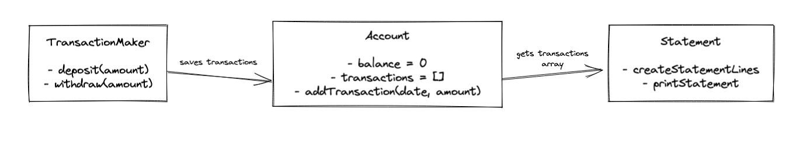

# Bank Tech Test

This is a little program I wrote in node.js to practise and demonstrate writing high quality code.

It simulates a bank account and keeps track of your balance, deposits and withdrawals.

Here is a  of the program in action.


## Usage:
Download a copy of this repository, then, in the directory, run 

`npm install`

To run the tests, run

`jest`

To see the coverage, run 

`jest --coverage`

Use the node REPL to run the program (by running `node`).

Run these lines first to import the classes and create instances of them:
```bash
const Account = require('./src/account');
const TransactionMaker = require('./src/transactionMaker');
const Statement = require('./src/statement');

const account = new Account;
const transactionMaker = new TransactionMaker(account);
const statement = new Statement(account);
```

Then you can run
```bash
transactionMaker.deposit(amount);
transactionMaker.withdraw(amount);
statement.printStatement();
```
to interact with the program.

You can also enter `node run.js` to see an example of how the program runs.

## My Approach:
I thought about the different classes and drew a diagram on how they should interact. 

There are 3 classes:
- Account - keeps track of all transactions along with the balance
- Statement - gets transactions from account to print a statement for the user to see
- TransactionMaker - handles deposits and withdrawals and sends them to the Account for storing.



I wrote the programm following Test Driven Development (TDD), always starting with a test and then writing code to implement that feature. Each test increased the complexity of the program incrementally.

After all the main features were implemented I tested for lots of edge cases on the user input, when calling the deposit and withdraw function.